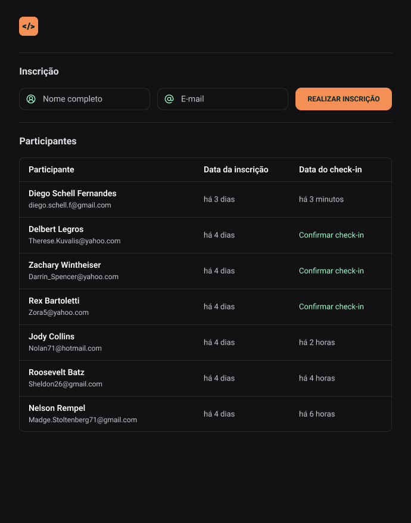

  

Aplicação desenvolvida no evento NLW Unite da Rocketseat, na trilha de HTML + CSS + JavaScript.

  <a href="#-tecnologias">Tecnologias</a>&nbsp;&nbsp;&nbsp;|&nbsp;&nbsp;&nbsp;
  <a href="#-projeto">Projeto</a>&nbsp;&nbsp;&nbsp;|&nbsp;&nbsp;&nbsp;
  <a href="#memo-licença">Licença</a>

  

 

  

## 🚀 Tecnologias

Esse projeto foi desenvolvido com as seguintes tecnologias:

- HTML
- CSS
- JavaScript
- Git
- FIGMA

## 💻 Projeto

- 
O projeto consiste no desenvolvimento da versão simplificada de um sistema de inscrição para eventos presenciais, onde o usuário preenche seus dados, efetiva a inscrição, e confirma o check-in no momento de sua preferência.

 

- [Acesse a aplicação finalizada, online](https://bernardosa01.github.io/NLW-Expert)
 

## :memo: Licença

Esse projeto está sob a licença MIT.

---

Feito por Bernardo Sá :wave: [Participe da comunidade da Rocketseat!](https://www.rocketseat.com.br/)